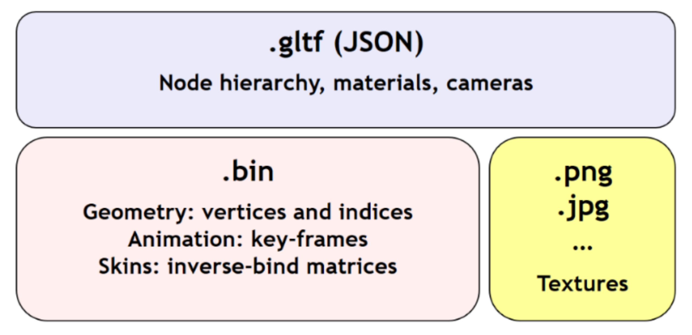
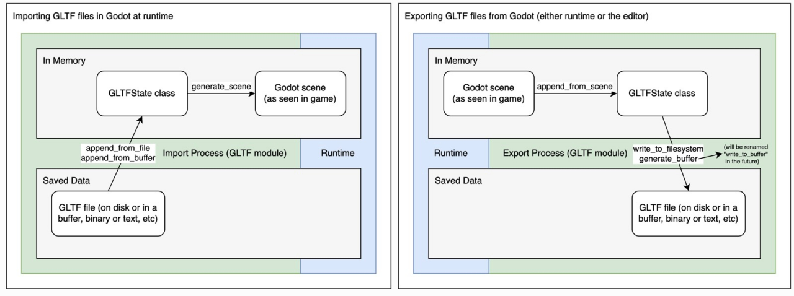
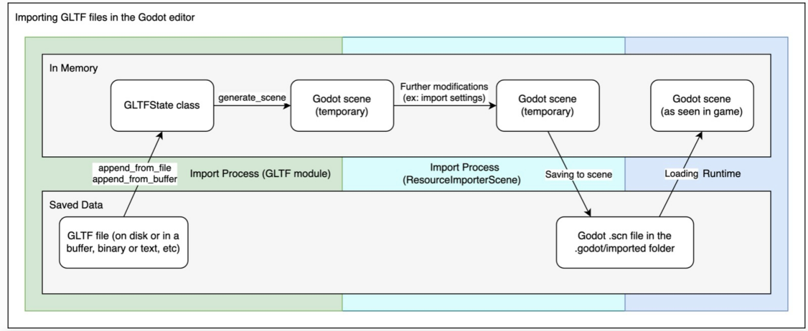

一．主流场景文件格式及其特点

1. XML

XML 是一种基于标签的标记语言，可用于描述结构化数据。由于其可读性强、标签可自定义、可扩展性高，被广泛用于配置文件、场景描述文件、物理参数配置等场合。

早期包括许多仿真平台和 3D 引擎都选择用 XML 来描述场景或者配置，如 Gazebo、Unreal（部分场景文件）、一些机器人操作系统（ROS）中的 URDF（Unified Robot Description Format）等，也都是基于 XML 的语法结构。

缺点：1. 文件冗长：大量标签使文件变得冗长，不适合在对文件大小敏感的场景（如网络传输、移动端）中广泛使用。2. 语法相对复杂：与 JSON 相比，XML 层级嵌套更深，编写和维护成本略高。

2. JSON

JSON 是一种轻量级的数据交换格式，因其与 JavaScript 原生对象格式类似而流行，几乎所有语言都提供了成熟的 JSON 解析库。相比于 XML，JSON 的结构更简洁，行文更少。如今在 Web、移动端以及各种现代应用中都得到广泛应用。

缺点：可扩展性不如 XML：JSON 不具备命名空间、属性等 XML 提供的更复杂的元数据支持。

3. glTF2.0

glTF由 OpenGL、Vulkan 等主导制定，是一个专门为 3D 场景和模型数据所设计的文件格式。具有高效、跨平台、可网络传输、可扩展地描述 3D 模型和场景，包括网格、纹理、材质、动画、骨骼、场景结构等信息。当前几乎所有主流 3D 建模软件和引擎（如 Blender、Maya、3ds Max、Unity、Unreal、Three.js 等）都支持或提供 glTF 插件，便于导入/导出。

glTF包括：JSON文件：描述场景、节点及其层次结构;网格、材质、相机、光源。它还包含指向二进制和图像数据的指针。二进制数据：场景中的实际几何体和动画数据。图像文件：图像数据存储为 JPG 或 PNG。

 

 

二．如何接入主流建模软件 

一．godot

 

​		1. Godot支持的3D场景文件格式：

1) glTF 2.0。Godot 完全支持文本（.gltf）和二进制（.glb）格式。
2) .blend（Blender）。这是通过调用 Blender 以透明方式导出到 glTF 来实现
3) DAE。
4) FBX
   2. 从Blender导出gITF2.0文件

1）作为 glTF 二进制文件（.glb）。

2）作为 glTF 文本文件，内嵌二进制数据（.gltf 文件）

3）作为 glTF 文本文件，二进制数据和纹理独立（.gltf 文件 + .bin 文件 + 纹理）。

 

glTF 导入过程中，首先将 glTF 文件的数据加载到内存中的 GLTFState 类中，然后使用该数据生成 Godot 场景。在运行时导入文件时，可以直接将该场景添加到树中。导出过程则与此相反，Godot 场景被转换为 GLTFState 类，然后从中生成 glTF 文件。

 

 

在编辑器中导入 glTF 文件时，还有两个步骤。生成 Godot 场景后，ResourceImporterScene 类用于应用其他导入设置，包括通过导入面板和高级导入设置对话框配置的设置。然后将其保存为 Godot 场景文件

 

具体流程：

1)将文件添加到项目中：将外部 3D 文件（如 .glb 或 .gltf）复制到 Godot 项目的文件系统中。

2)配置导入设置：在 Godot 编辑器中，选择导入的文件，打开“导入”面板。根据需要，调整导入选项，例如缩放比例、根节点类型、材质处理方式等。 

3)应用导入提示（可选）：在 3D 建模软件中，可以通过在对象名称中添加特定后缀（如 -col、-rigid）来指示 Godot 在导入时将其转换为特定类型的节点，如碰撞体或刚体。 

4)处理材质和纹理：确保所有相关的纹理文件位于项目中正确的位置。Godot 会根据导入的 3D 文件自动创建材质，但可能需要手动调整以匹配项目的渲染需求。

5)保存和实例化场景：完成导入配置后，点击“重新导入”按钮。Godot 会生成一个 .tscn 或 .scn 场景文件，可在项目中实例化和使用。

 