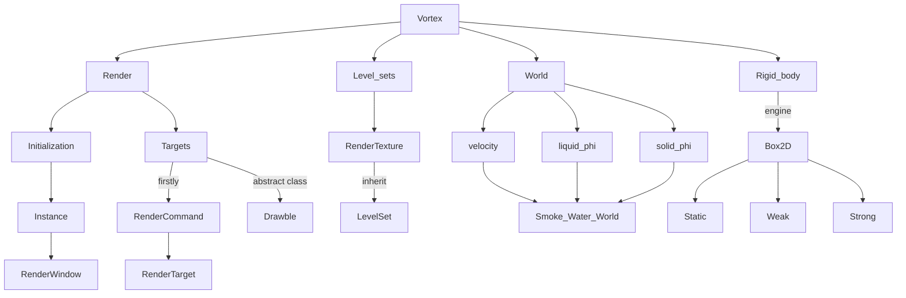
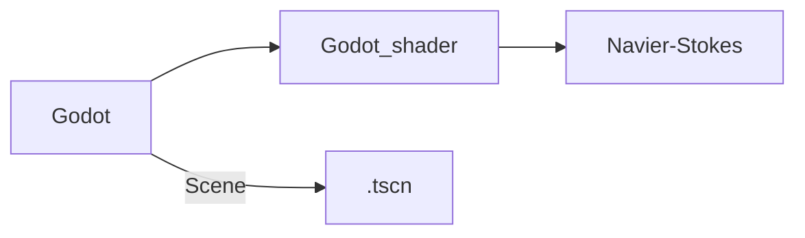
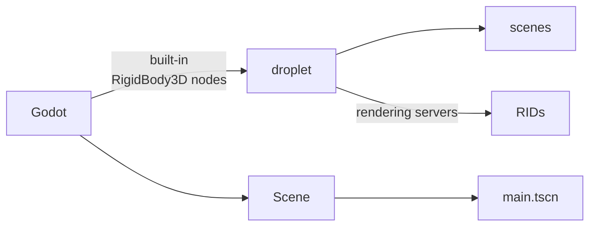

##### 1. [Vortex](https://github.com/mmaldacker/Vortex2D) based on Vulkan




#### Render:

- Initialization:

  ```mermaid
  graph LR
  
  Instance -->|Prefix <br>Vortex2D::Renderer::| Device -->|creat<br> other instance| RenderWindow -->|function| r(sprites and polygons)
  
  present_result -->|use| Vortex2D::Fluid::RenderWindow::Display
  
  ```

- Render Targets:

  ```mermaid
  graph LR
  
  Render-->|firstly|RenderCommand
  RenderCommand-->|record on|RenderTarget-->|implementation|RenderWindow
  RenderTarget-->|implementation|RenderTexture
  
  Render-->|abstract class|Drawable-->|record on|RenderCommand
  Drawable-->|call|submit_function-->|draw on screen|object
  Drawable-->|pass in|blend_state-->|draw on screen|object
  ```


##### 2. [2D-Fluid-Simulation](https://github.com/Maaack/2D-Fluid-Simulation)



##### 3. [godot-fluid-smi](https://github.com/thompsop1sou/godot-fluid-sim)



