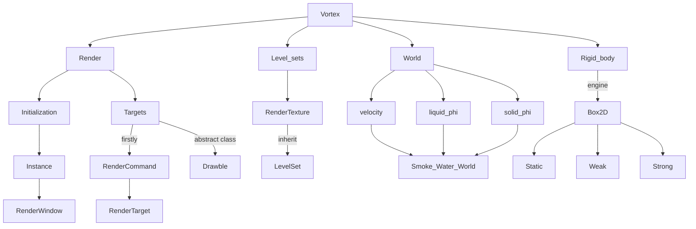
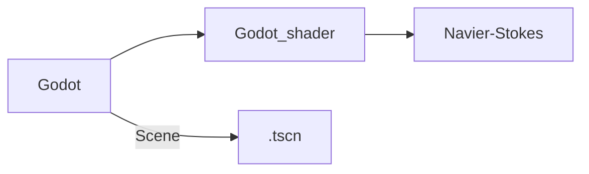
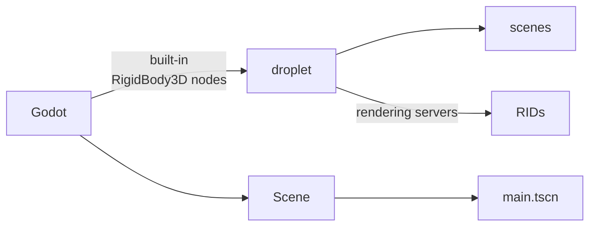
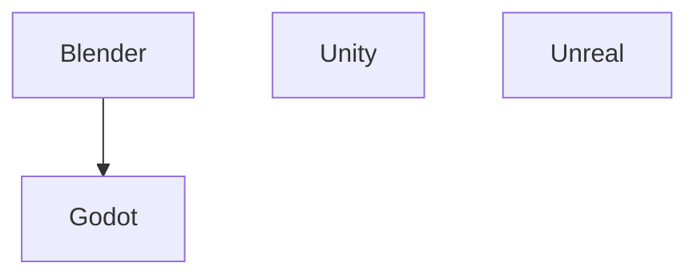
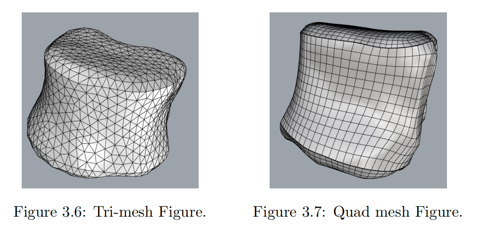
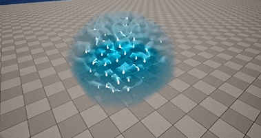
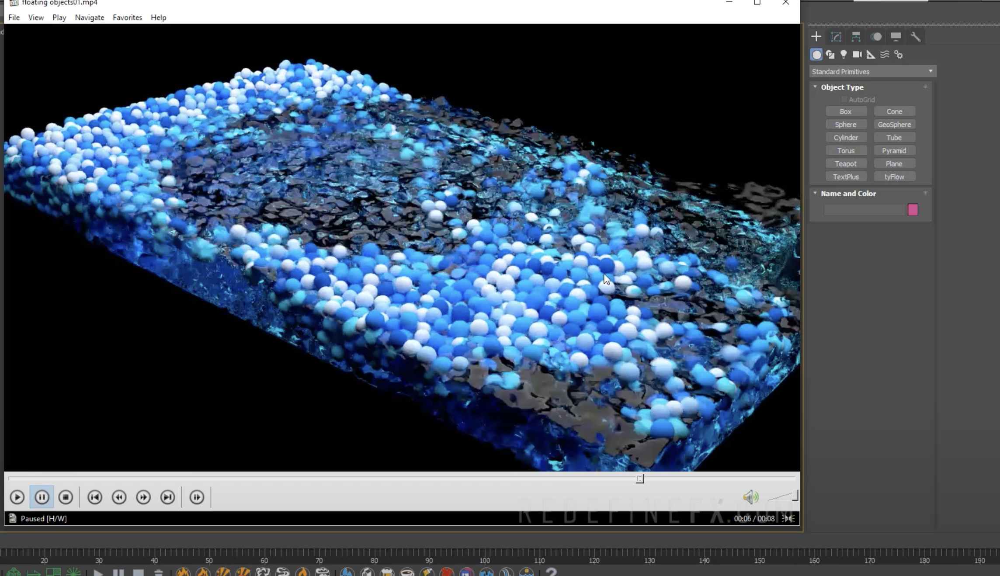

##### 1. [Vortex](https://github.com/mmaldacker/Vortex2D) based on Vulkan




#### Render:

- Initialization:

  ```mermaid
  graph LR
  
  Instance -->|Prefix <br>Vortex2D::Renderer::| Device -->|creat<br> other instance| RenderWindow -->|function| r(sprites and polygons)
  
  present_result -->|use| Vortex2D::Fluid::RenderWindow::Display
  
  ```

- Render Targets:

  ```mermaid
  graph LR
  
  Render-->|firstly|RenderCommand
  RenderCommand-->|record on|RenderTarget-->|implementation|RenderWindow
  RenderTarget-->|implementation|RenderTexture
  
  Render-->|abstract class|Drawable-->|record on|RenderCommand
  Drawable-->|call|submit_function-->|draw on screen|object
  Drawable-->|pass in|blend_state-->|draw on screen|object
  ```


##### 2. [2D-Fluid-Simulation](https://github.com/Maaack/2D-Fluid-Simulation)



##### 3. [godot-fluid-smi](https://github.com/thompsop1sou/godot-fluid-sim)




##### 4. [Towards Real-Time Hydrodynamics and Fluid Simulation for Marine Robotics](https://github.com/YosefGuevara012/Towards-Real-Time-Hydrodynamics-and-Fluid-Simulation-for-Marine-Robotics)



1. Game Engine:

   - **Godot**: Godot’s lightweight framework allows for superior optimization within the Linux environment
   - Unity
   - Unreal engine

2. Creating Simulation Assets

   - **Blender**: Offering an export format, composed of tri-mesh (3-vertex polygons) or quad-mesh (4-vertex polygons)

     

   - Others: SolidWorks, Autodesk Inventor, or Rhinoceros,  additional adjustments are often needed

3. Algorithm Implementation for Simulation

   - **Algorithm for Open Sea**
     - Using finite difference methods  to simulate wave dynamics (有限差分法)
   - **Shallow Water Algorithm**
     - The algorithm to be implemented is a combination of mesh-based and particle-based methods. 
     - Particles are used to represent aspects of water that cannot be captured with the mesh-based approach, such as  spray, splashes, and foam.
   - **Underwater Algorithm**
     - Utilizing Sparus II AUV to achieve collision
   - **Rendering Techniques**
     - Employing noise-based techniques to provide a general texture to the ocean


------

##### 一. UE (基本都是基于GPU)

1. [UE Niagara](https://github.com/mushe/NiagaraFluid)



与Epic 官方插件“Niagara Fluids”无关。这是另一个独立的实现，并使用 SPH 方法.


2. [Gvdb-fluid-unreal](https://github.com/W298/gvdb-fluid-unreal)

   在 Unreal Engine 5 上使用 NVIDIA GVDB 库实现流体仿真（FLIP）。

   粒子的模拟通过 Niagara 系统完成。（使用 Sprite Renderer 和 Mesh Renderer 进行渲染）


###### 二. [LiquiGen](https://www.youtube.com/watch?v=7pVP7WjTYLE)
[start](https://www.youtube.com/watch?v=db2XawZWBaI)

Importing objects from Blender and exporting meshes to Blender


###### 三. [PhysX Fluid tyFlow](https://www.youtube.com/watch?v=McDV8KUFzsA)

包括水流破坏、受海浪影响的漂浮船只，甚至是电影《闪灵》中的电梯场景。

都是UI性的操作
